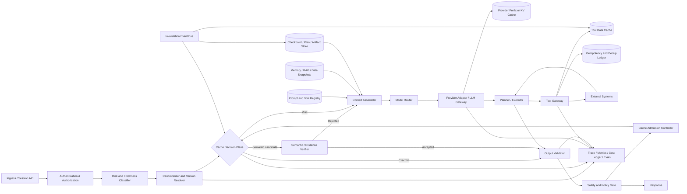

下面给出一套可直接用于 **Agent 平台架构评审、成本治理和优化实验** 的方法论。

**信息边界：**服务商能力与计费文档核实至 **2026 年 8 月 23 日（Asia/Taipei）**。Provider Prompt Cache 的最小前缀、TTL、写入费用、路由方式和断点规则都可能继续变化，实施时应把这些参数放入 Provider Capability Registry，而不是硬编码到 Harness。

全文采用三类标记：

- **[资料证实]**：来自服务商官方文档、标准或公开论文。
    
- **[工程建议]**：由上述机制推导出的架构方法。
    
- **[待实验]**：收益和适用边界取决于实际流量，必须用本地 workload 验证。
    

---

# 1. 执行摘要

## 1.1 最重要的结论

Agent Harness 的优化目标不应是“最大化 Cache Hit Rate”，而应是：

[  
\min_{\pi}\quad  
\mathbb{E}\left[  
C_{\text{task}}  
+\lambda_L L_{\text{E2E}}  
+\lambda_F \operatorname{Loss}_{\text{failure}}  
+\lambda_S \operatorname{Loss}_{\text{security}}  
\right]  
]

约束为：

[  
\begin{aligned}  
Q_{\text{candidate},s} &\ge Q_{\text{baseline},s}-\delta_s,\quad \forall s\  
P(\text{critical safety error})_{\text{candidate}}  
&\le P(\text{critical safety error})_{\text{baseline}}+\epsilon\  
P(\text{cross-scope leak})&=0  
\end{aligned}  
]

其中 (s) 是任务类型、风险级别、用户类型、上下文长度等分层，(\delta_s) 是预先声明的质量非劣界限。

推荐决策如下。

|架构问题|推荐默认值|
|---|---|
|首要优化对象|**每任务风险调整后总成本**，不是请求级命中率|
|优化顺序|可观测性 → 稳定前缀 → 精确缓存 → 工具缓存 → 中间产物 → 语义缓存|
|Provider Prompt Cache|用来复用稳定输入前缀，降低 prefill 成本和 TTFT；**不会跳过输出生成**|
|精确结果缓存|对纯函数式、已验证、低时效风险任务优先使用|
|语义缓存|默认只作为“候选结果检索层”，必须经过权限、版本、时效和语义验证|
|工具调用|只读调用使用数据缓存和条件重验证；有副作用调用使用幂等账本，不使用普通结果缓存|
|计划和中间状态|优先缓存“参数化计划模板、纯中间产物和可恢复 checkpoint”，不要直接复用完整旧轨迹|
|上下文压缩|优先压缩动态后缀；不要持续重写稳定前缀|
|模型路由|按任务难度和风险路由；缓存亲和性只能作为次级目标|
|质量门槛|每个任务分层做非劣检验；安全、权限和副作用正确性采用硬门槛|
|核心缓存指标|同时报告请求命中、Token 命中、金额命中、写放大和命中质量|

Provider Prefix/KV Cache 只减少共享前缀的预填充计算，不减少新输出 Token 的解码时间；如果任务主要耗时在长输出生成，即使前缀命中率很高，端到端延迟收益也可能有限。OpenAI 也明确说明 Prompt Caching 不保证相同输出；vLLM 文档明确指出 Automatic Prefix Caching 只优化 prefill、不能优化 decode。 ([OpenAI Developers](https://developers.openai.com/api/docs/guides/prompt-caching "Prompt caching | OpenAI API"))

## 1.2 推荐的分层复用策略

由低风险到高风险：

1. **Provider Prefix Cache**：同样的稳定前缀，仍由模型重新推理和生成。
    
2. **精确结果缓存**：完全相同的计算契约，直接复用已验证结果。
    
3. **工具及外部数据缓存**：复用原始数据，但重新执行当前任务的推理和安全决策。
    
4. **Agent 中间产物缓存**：复用解析、检索、计划模板、编译 DAG、测试产物。
    
5. **语义缓存**：只在严格作用域和验证器通过后复用；高风险场景默认旁路。
    

这五层不是互斥关系。一次 Agent 运行可能同时命中工具缓存、计划模板和 Provider Prefix Cache。

---

# 2. 缓存类型与机制对照表

## 2.1 五类缓存的本质差异

|类型|缓存对象|典型匹配条件|作用范围与生命周期|失效条件|主要收益|主要风险|
|---|---|---|---|---|---|---|
|**Provider Prompt/KV Cache**|已处理输入前缀对应的 Provider 内部计算结果或 KV 状态|同一模型/端点下的精确渲染前缀；可能还要求相同 cache key、断点、工具和图片顺序|Provider 管理；通常短 TTL、内存淘汰或显式缓存对象|前缀任意位置变化、模型变化、TTL、路由到无缓存实例、断点变化|降低 cached input 价格、prefill 和 TTFT|命中不稳定、写放大；不能减少输出生成|
|**精确结果缓存**|最终答案、结构化输出或确定性子任务结果|完整计算契约的规范化哈希完全一致|Harness 管理；TTL、版本或依赖驱动|输入、策略、模型、工具、数据快照、权限、输出 Schema 任一变化|可完全跳过一次或多次 LLM 调用|Key 不完整导致陈旧结果或跨用户泄漏|
|**语义缓存**|历史问题及其结果、Embedding、元数据|向量相似度，加上作用域、意图、约束、时效和验证器|Harness 或网关管理；通常应短 TTL、分区|阈值未通过、验证失败、数据/权限/策略变化|可复用措辞不同但意图等价的结果|语义误命中、缓存投毒、碰撞攻击|
|**工具及外部数据缓存**|API、搜索、数据库、文件、RAG 原始结果|工具名/版本、规范化参数、认证作用域、数据版本、时效模式一致|工具网关；由源系统 Cache-Control、ETag、TTL 或事件驱动失效|数据版本、权限、ETag、Schema、工具版本变化|减少工具延迟、费用和下游 LLM 输入|陈旧数据、权限扩大、缓存错误响应|
|**中间状态、规划及产物缓存**|Checkpoint、解析结果、检索候选、计划模板、DAG、代码、报告片段|任务类型、依赖清单、环境、策略、工具版本和验证器兼容|Agent State Store / Artifact Store；版本化、事件驱动|依赖、环境、目标、权限、验证状态变化|减少规划、恢复和重复工具调用|旧计划不适配、错误中间状态被放大|

### 一个容易混淆的边界

**同一次自回归生成内部的 KV Cache** 是推理服务器的基础实现，不是 Harness 层的跨请求 Cache Hit Rate。Harness 能影响的是：

- 请求之间是否具有相同前缀；
    
- 请求是否路由到可复用缓存的模型实例；
    
- 是否使用显式缓存对象或断点；
    
- 是否在自托管系统中配置跨实例 KV 层级和调度。
    

## 2.2 当前主流 Provider 的缓存语义不能泛化

以下是截至访问日的代表性差异。

|Provider / 实现|当前匹配语义|最小长度与生命周期|费用与观测|Harness 注意事项|
|---|---|---|---|---|
|**OpenAI GPT-5.6+**|在 eligible breakpoint 对精确前缀匹配；`prompt_cache_key` 用于提升稳定路由和匹配。默认隐式断点位于最新 user/tool message，显式模式可自行放置断点|最小 1,024 Token；当前 TTL 为 30 分钟，命中后刷新|当前 cached read 为未缓存输入价的 0.1 倍，cache write 为 1.25 倍；返回 `cached_tokens` 与 `cache_write_tokens`。缓存 Token 仍计入 TPM|将静态 instructions、tools、files 放在断点前；动态时间戳和当前输入放断点后；关注写入多而读取少的现象。早期模型行为和写费不同，不应混用假设。 ([OpenAI Developers](https://developers.openai.com/api/docs/guides/prompt-caching "Prompt caching \| OpenAI API"))|
|**Anthropic Claude**|精确前缀；逻辑顺序为 `tools → system → messages`；支持自动和显式 breakpoint，最多 4 个，自动回看窗口为 20 个 block|默认 5 分钟，可选 1 小时；最小长度按模型变化|5 分钟写入 1.25 倍、1 小时写入 2 倍、读取 0.1 倍；返回 cache creation/read Token|含时间戳的变化 block 放在断点前会反复写入而无读取；并发请求中，缓存要到第一个响应开始后才可用。 ([Claude Platform Docs](https://docs.anthropic.com/en/docs/build-with-claude/prompt-caching "Prompt caching - Claude Platform Docs"))|
|**Google Gemini**|Gemini 2.5 及更新模型支持隐式缓存；Interactions API 当前仅支持隐式缓存，GenerateContent 可创建显式缓存对象|当前文档中 Gemini 2.5 最小 2,048 Token，更新的部分型号为 4,096；显式缓存默认 TTL 1 小时，可更新和删除|显式缓存成本与缓存 Token 数和持有时间相关；隐式命中可获得成本优惠|大型公共前缀放前部；显式缓存适合稳定文档、代码库和长 system instruction；存储费必须计入 break-even。 ([Google AI for Developers](https://ai.google.dev/gemini-api/docs/caching "Context caching  \|  Gemini API  \|  Google AI for Developers"))|
|**Amazon Bedrock**|语义取决于所选基础模型；通过 cache checkpoint 或模型特定机制定义连续前缀|最小 Token、最多 checkpoint 数和 TTL 均按模型变化；当前表中常见最多 4 个 checkpoint，TTL 可为 5 分钟、1 小时或 30 分钟|价格和吞吐规则同样按模型变化|Bedrock 是多模型封装层，不能把某个 Claude 或 OpenAI 模型的行为推广到整个 Bedrock。 ([AWS Documentation](https://docs.aws.amazon.com/bedrock/latest/userguide/prompt-caching.html "Prompt caching for faster model inference - Amazon Bedrock"))|
|**自托管 vLLM / SGLang**|基于相同 Token 前缀复用 KV；SGLang 可扩展到 GPU、主机内存和分布式存储层|由 GPU 内存、页大小、淘汰和 L2/L3 KV 系统决定|没有 Provider cached-token 账单，但有 GPU 内存、传输、存储和调度成本|需要前缀感知路由、热点淘汰和多租户隔离；KV 从远端加载的延迟可能抵消计算节省。 ([vLLM](https://docs.vllm.ai/en/latest/features/automatic_prefix_caching/ "Automatic Prefix Caching - vLLM"))|

OpenAI 和 Anthropic 都明确指出 Prompt Cache 不改变输出生成过程，因此 **Provider Cache Hit ≠ 最终结果复用**。 ([OpenAI Developers](https://developers.openai.com/api/docs/guides/prompt-caching "Prompt caching | OpenAI API"))

---

# 3. Agent Harness 中影响缓存命中的关键因素

## 3.1 破坏 Provider Prefix Cache 的因素

Provider Prompt Cache 的核心因果链是：

[  
\text{前缀任何较早位置变化}  
\Rightarrow  
\text{后续 Token 位置和 KV 全部变化}  
\Rightarrow  
\text{最长可复用前缀缩短或归零}  
]

因此，“内容大致一样”通常没有意义；要关注 Provider 最终收到的 **渲染后序列**。

|破坏因素|为什么导致 miss|推荐处理|
|---|---|---|
|System Prompt 内的当前时间、请求 ID、Trace ID|动态字段出现在最前方，使整个后续序列失配|从模型输入移除；必须给模型时放到动态后缀|
|每次构建 Prompt 时调整段落顺序|精确前缀位置不同|建立版本化 Prompt Registry，按固定顺序组装|
|工具数组顺序变化|工具定义通常处于前缀，数组顺序也是序列的一部分|对工具目录采用稳定排序；不要依赖 map 迭代顺序|
|Tool Schema 描述、默认值或 JSON 字段顺序变化|Provider 渲染出的工具前缀发生变化|Schema 版本化；使用确定性序列化|
|每请求只发送“当前可用工具”的随机子集|工具前缀分裂为大量组合|对常见能力建立有限的稳定工具套餐；运行时再做权限校验|
|在旧消息中插入、删除或改写内容|破坏从该消息开始的所有前缀|会话历史尽量 append-only；摘要建立新 generation|
|每轮重新生成不同措辞的会话摘要|摘要位于长前缀中，导致新缓存世代|只在明确 compaction boundary 更新，摘要加版本|
|使用模型生成式 Prompt 压缩改写稳定段|即使 Token 更少，也可能完全失去旧前缀命中|保持稳定锚点不变，优先压缩动态 RAG 和历史后缀|
|A/B 实验共用缓存 namespace|一个实验组写入另一个实验组的缓存或互相污染统计|key 中包含 experiment arm / prompt version|
|模型路由到不同 Provider 或模型版本|KV 和服务端缓存空间不同|结果缓存 key 包含 model；Prefix Cache 建立模型亲和但不牺牲质量|
|冷启动并发扇出|多个请求在首个写入可用前同时 miss|singleflight、leader warming、请求合并|
|TTL 到期或实例淘汰|前缀相同但物理缓存不存在|按实际重用间隔选 TTL；不要只分析逻辑 key|
|图片、文件或多模态参数变化|图片设置和文件内容常作为前缀的一部分|对文件使用内容摘要和稳定版本；动态文件放后缀|
|在重试 Prompt 中加入 `attempt=2`|原本可完全复用的重试变成新前缀|重试元数据只进入 Trace，不进入模型 Prompt|

OpenAI 明确要求 static instructions、examples、images 和 tools 位于前部且保持一致；Anthropic 文档也给出了动态时间戳导致“每次写入、从不读取”的示例，并要求断点放在稳定前缀末尾。 ([OpenAI Developers](https://developers.openai.com/api/docs/guides/prompt-caching "Prompt caching | OpenAI API"))

## 3.2 “减少输入 Token”与“提高命中率”是两种不同机制

设：

- (I)：输入 Token；
    
- (R)：命中的 cached input Token；
    
- (P_u)：普通输入单价；
    
- (P_r)：缓存读取单价。
    

**减少 Token** 的直接收益为：

# [  
\Delta C_{\text{token reduction}}

\Delta I \cdot P_u  
]

它不要求请求重复。

**提高缓存命中** 的直接读取收益近似为：

# [  
\Delta C_{\text{cache read}}

R(P_u-P_r)  
]

但还必须扣除缓存写入、存储、检索和验证开销。

|改动|输入 Token|Cache Hit Rate|解释|
|---|--:|--:|---|
|删除动态后缀中的冗余 RAG 文本|下降|可能不变|只是每次请求更短|
|固定工具 Schema 和排序|可能不变|上升|序列更稳定|
|把时间戳从前缀移到后缀|不变|上升|动态内容不再破坏共享前缀|
|压缩整个 Prompt，包括 system/tool|大幅下降|可能下降|每次压缩结果不同会破坏前缀|
|增加大型稳定说明书作为共享前缀|上升|Token 命中可能上升|冷请求成本更高，需足够重复才盈利|
|删除内容使 Prompt 低于 Provider 最小阈值|下降|归零|Token 更少，但不再 eligible|
|使用精确结果缓存|输入可能归零|Provider Hit Rate 可能下降|请求根本不再到 Provider，却显著节省成本|

因此要把以下两组实验分开：

1. **Token Efficiency 实验**：保持缓存逻辑不变，测试上下文裁剪或压缩。
    
2. **Cacheability 实验**：保持语义和长度尽量不变，测试稳定前缀、断点和序列化。
    

LLMLingua 等论文表明 Prompt 压缩在特定数据集上可以大幅减少 Token，但这些是压缩收益，不等同于缓存收益；同时，改写稳定前缀可能重置缓存。论文中的最高压缩或延迟数字只是特定基准结果，不应直接用于容量预算。 ([arXiv](https://arxiv.org/abs/2310.05736 "[2310.05736] LLMLingua: Compressing Prompts for Accelerated Inference of Large Language Models"))

## 3.3 如何识别“真正影响成本”的命中

请求级指标：

[  
CHR_{\text{request}} =  
\frac{\text{发生任意命中的 eligible 请求数}}  
{\text{eligible lookup 请求数}}  
]

可能产生误导。例如：

- 100 个请求各命中 100 Token；
    
- 10 个长请求各 miss 20,000 Token。
    

请求命中率可能超过 90%，但主要成本仍来自那 10 个长请求。

至少同时使用：

# [  
CHR_{\text{token}}

\frac{\sum R_i}{\sum E_i}  
]

以及：

# [  
CHR_{$}

\frac{\text{相对于同质量基线节省的输入费用}}  
{\text{基线可缓存输入费用}}  
]

其中 (E_i) 是第 (i) 次请求中理论上可缓存的 Token。

还要观察：

- `cache_write_tokens / cached_tokens`；
    
- 每任务总模型调用次数；
    
- 每任务输出 Token；
    
- 重试率；
    
- E2E 延迟；
    
- 命中请求与未命中请求的质量差；
    
- 缓存基础设施与验证器成本。
    

OpenAI 当前文档也建议同时观察读 Token 和写 Token；持续高写入、低读取通常表示断点前包含动态内容。 ([OpenAI Developers](https://developers.openai.com/api/docs/guides/prompt-caching "Prompt caching | OpenAI API"))

---

# 4. 推荐的架构与设计原则

## 4.1 参考架构



## 4.2 模块职责与缓存边界

### Authentication、Authorization 与 Risk Classifier

在任何跨请求缓存查询之前确定：

- tenant；
    
- user 或授权等价类；  
    -数据分类；  
    -当前权限 epoch；  
    -任务风险；  
    -所需时效和一致性级别。
    

**原则：先确定作用域，再查缓存。**不能先检索全局语义缓存，再在结果返回前才检查权限，因为候选检索、日志和侧信道本身也可能泄漏信息。

### Canonicalizer

负责：

- 规范化结构化请求；
    
- 解析 Prompt、工具、模型和策略版本；
    
- 生成缓存 key envelope；
    
- 区分语义字段与非语义运行元数据；
    
- 计算分段 digest。
    

JSON 可以采用 RFC 8785 JCS 或等价方案，确保 primitive 序列化和对象属性排序确定；数组顺序应保留，因为消息和工具数组通常具有语义。任何 Unicode、空白或大小写归一化都应作为独立、版本化的业务规则，不能默认认为语义等价。 ([RFC Editor](https://www.rfc-editor.org/info/rfc8785/ "RFC 8785: JSON Canonicalization Scheme (JCS) | RFC Editor"))

### Cache Decision Plane

统一执行：

1. 高风险或强时效任务是否旁路；
    
2. 精确结果查找；
    
3. 语义候选查找及验证；
    
4. 计划、产物和状态查找；
    
5. miss 合并和 singleflight；
    
6. cache admission；
    
7. 依赖驱动失效。
    

不要让不同业务团队在 Agent 节点中自行拼接 Redis key，否则无法统一审计权限、版本和失效规则。

### Prompt / Tool Registry

保存不可变、版本化的：

- System Prompt；  
    -安全策略；  
    -输出 Schema；  
    -工具定义；
    
- Few-shot 示例；
    
- Prompt 构建模板；
    
- Provider 特定 breakpoint 映射。
    

Registry 中一个版本发布后不应原地修改，而应生成新版本 ID。

### Provider Adapter

将统一逻辑上下文映射为 Provider 特定格式：

- OpenAI 的 breakpoint 与 `prompt_cache_key`；
    
- Anthropic 的 `tools → system → messages` 和 `cache_control`；
    
- Gemini 显式缓存对象；
    
- Bedrock 模型特定 checkpoint；
    
- 自托管 Prefix-aware routing。
    

### Tool Gateway

负责：

- 工具参数规范化；  
    -权限检查；  
    -缓存策略；  
    -ETag / Last-Modified 条件请求；  
    -速率限制；  
    -幂等 key；  
    -结果 Schema 验证；  
    -来源、时间和版本标记。
    

HTTP 缓存应优先服从源系统的 Cache-Control 和 validator；ETag、Last-Modified 及条件请求比盲目 TTL 更能保持一致性。RFC 9110/9111 定义了相关缓存和验证语义，RFC 9211 提供了标准化 `Cache-Status` 诊断思路。 ([RFC Editor](https://www.rfc-editor.org/info/rfc9111/ "RFC 9111: HTTP Caching | RFC Editor"))

### Checkpoint / Plan / Artifact Store

保存可恢复的工作流事件、阶段输出、依赖清单和验证状态。工作流控制逻辑应可确定性重放，LLM 和外部 I/O 应位于显式、可重试的 Activity 边界。Temporal 文档也建议将 LLM/API 等非确定性操作放在可重试 Activity，而不是不可控地重跑整个工作流。 ([Temporal](https://docs.temporal.io/encyclopedia/retry-policies "What is a Temporal Retry Policy? | Temporal Documentation"))

---

## 4.3 稳定层与动态层的 Prompt 分解

推荐的逻辑层次：

|层|内容|典型稳定性|推荐缓存边界|
|---|---|---|---|
|A|产品级 system instruction、安全原则、输出协议|发布周期|最稳定共享前缀|
|B|工具目录、Tool Schema、调用规则|发布周期|A+B 后可设 breakpoint|
|C|Tenant 策略、业务规则、共享知识快照|天至发布周期|按 tenant/policy 分区|
|D|用户长期偏好、会话固定属性|会话或 profile 版本|仅同用户/授权范围内复用|
|E|Append-only 对话历史及稳定工具轨迹|每轮追加|利用增长式前缀复用|
|F|当前用户请求、当前 RAG、时间、实时数据、重试反馈|每请求|放在最后，不期待跨请求前缀复用|

逻辑顺序不必与所有 Provider 的 API 字段顺序完全相同。Provider Adapter 应保持“稳定内容先于动态内容”的性质，同时遵守 Provider 的实际渲染规则。例如 Anthropic 将工具、system、messages 依次组成前缀，因此工具目录的变化会使后续 system 和 messages 缓存一起失效。 ([Claude Platform Docs](https://docs.anthropic.com/en/docs/build-with-claude/prompt-caching "Prompt caching - Claude Platform Docs"))

安全策略不应仅为了共享而移到模型不可见的位置。正确做法是：

- 对相同策略版本形成共享 cohort；
    
- 不同策略版本使用不同 namespace；
    
- Executor 层再次强制执行工具权限；
    
- 接受必要的安全分区所造成的命中率下降。
    

## 4.4 精确结果缓存 Key

不要仅使用：

```text
hash(user_message)
```

推荐使用完整的计算契约：

```text
CacheEnvelope {
  environment,
  region,
  tenant_id,
  user_or_authz_class,
  authz_epoch,
  data_classification,

  task_type,
  canonical_input,
  conversation_generation,

  system_prompt_version,
  policy_version,
  tool_catalog_version,
  tool_schema_digest,
  output_schema_version,

  router_version,
  model_provider,
  model_id,
  model_revision,
  decoding_parameters,

  retrieval_index_version,
  source_snapshot_ids,
  locale,
  timezone,
  freshness_class,
  experiment_arm
}

key = SHA256(
  cache_namespace || JCS(CacheEnvelope)
)
```

### Key 中必须包含什么

只要某字段变化可能合理地改变输出，它就应该：

- 进入 key；  
    -或者使查询旁路；  
    -或者通过读取后验证处理。
    

常被遗漏的字段包括：

- 模型修订版；  
    -温度、reasoning effort 和最大输出；
    
- Tool Schema 版本；  
    -策略和输出格式；  
    -索引快照；  
    -数据过滤器；  
    -用户权限 epoch；  
    -语言、时区和当前日期桶；  
    -实验组。
    

### 不应进入语义 Prompt、但可进入 Trace 的字段

- request ID；  
    -trace ID；  
    -主机名；  
    -attempt number；  
    -日志采样 ID；  
    -随机 span ID；  
    -构建时间；  
    -非语义监控标签。
    

这些字段进入缓存 key 会降低结果缓存命中；进入 Prompt 前缀则会同时破坏 Provider Cache。

## 4.5 语义缓存的安全查询流程

```python
def semantic_lookup(request, context):
    if context.risk_class in {"critical", "side_effecting"}:
        return MISS("BYPASS_HIGH_RISK")

    candidates = vector_index.search(
        embedding=request.embedding,
        namespace=context.authz_namespace,
        top_k=8,
    )

    for item in candidates:
        if item.policy_version != context.policy_version:
            continue
        if item.authz_epoch != context.authz_epoch:
            continue
        if not versions_compatible(item.data_versions, context.data_versions):
            continue
        if not freshness_ok(item.generated_at, context.freshness_class):
            continue
        if not constraints_equivalent(item.request, request):
            continue
        if not evidence_coverage_ok(item, request):
            continue
        if not semantic_verifier_accepts(item, request):
            continue
        if not output_safety_validator_accepts(item.response):
            continue

        return HIT(item)

    return MISS("NO_VERIFIED_CANDIDATE")
```

相似度只能决定“候选召回”，不应单独决定“可返回”。

Azure 官方语义缓存文档明确警告：基于相似度返回结果可能产生不正确、过时或不安全的回答，并提供 `vary-by` 以限制跨用户访问。 ([Microsoft Learn](https://learn.microsoft.com/en-us/azure/api-management/llm-semantic-cache-lookup-policy "Azure API Management policy reference - llm-semantic-cache-lookup | Microsoft Learn"))

进一步地，公开研究指出：

- 固定全局相似度阈值无法提供稳定的错误率保证；
    
- 不同缓存项可能需要不同阈值；
    
- 模糊 key 存在恶意碰撞和响应劫持攻击面。
    

vCache 在其研究中观察到静态阈值可能产生不可预期错误率；2026 年 CacheAttack 论文在其攻击环境中报告了超过 86% 的命中攻击率，并研究了对 Agent 工具选择的劫持。这些数字是攻击论文中的实验结果，不代表普通生产流量的发生概率，但足以说明语义缓存必须被视为安全边界。 ([arXiv](https://arxiv.org/html/2502.03771v3 "vCache: Verified Semantic Prompt Caching"))

## 4.6 什么中间结果适合复用

|中间结果|可复用条件|命中后的处理|
|---|---|---|
|文档解析、OCR 后处理、代码 AST|内容摘要、解析器版本、配置一致|可直接使用并做完整性校验|
|Chunking 与 Embedding|文档摘要、chunker、embedding 模型及版本一致|直接使用|
|RAG 候选集合|index snapshot、filter、ACL、query normalization 一致|通常仍需 rerank 或时效验证|
|参数化计划模板|任务类型、工具能力和约束相同|填槽后做计划验证|
|编译后的工具 DAG|工具依赖、Schema、并发规则一致|对动态叶节点重新求值|
|结构化抽取结果|输入摘要、Schema、模型/解析器版本一致且已验证|可直接复用|
|代码、SQL、报告片段|依赖 manifest、环境、测试和策略一致|重新运行测试或 verifier|
|会话摘要|同一用户、会话 generation、摘要算法和策略一致|只在该会话内使用|
|Agent Checkpoint|Workflow 版本与活动幂等契约一致|从已提交边界恢复|

## 4.7 哪些结果必须重新生成或验证

默认重新生成或重新验证：

- 当前权限和授权判断；  
    -余额、价格、库存、位置、时间、天气、赛程等实时事实；  
    -安全审核、合规和风险决策；  
    -涉及支付、发送、删除、修改等副作用的实际执行；  
    -依赖当前工具可用性和失败状态的计划；  
    -基于新证据的结论；  
    -用户明确要求多样性或探索性的创意输出；  
    -来自未验证旧模型或旧 Prompt 的缓存结果；  
    -任何部分失败、截断、超时或 guardrail 未完成的输出。
    

## 4.8 计划缓存优于完整轨迹复用

推荐缓存：

```text
PlanTemplate {
  task_class,
  required_slots,
  abstract_steps,
  dependency_edges,
  tool_capability_requirements,
  preconditions,
  postconditions,
  verification_rules,
  plan_version
}
```

而不是直接缓存：

```text
old user input
+ all model thoughts
+ all old tool outputs
+ all old retries
+ final answer
```

原因是旧轨迹通常混入：

- 特定实体；  
    -陈旧工具结果；  
    -错误尝试；  
    -旧权限；  
    -不再有效的执行顺序；  
    -大量无关 Token。
    

一项 2025 年计划缓存研究在 FinanceBench 和 TabMWP 两类 workload 上报告了平均 46.62% 的成本降低和 96.67% 的最优应用性能保持；同一研究中，完整历史缓存比经过过滤的计划模板成本更高、准确率更低，普通语义缓存也出现较多误命中。这是特定论文环境的结果，应视为设计依据和实验假设，而不是通用收益承诺。 ([arXiv](https://arxiv.org/html/2506.14852v1 "Cost-Efficient Serving of LLM Agents via Test-Time Plan Caching"))

## 4.9 模型路由、任务分解和并发

### 模型路由

路由目标应为：

[  
\operatorname*{argmin}_{m}  
\mathbb{E}[C_m + C_{\text{retry},m}]  
\quad  
\text{s.t.}\quad  
P(Q_m \ge q_{\min}\mid x,risk)\ge 1-\alpha  
]

缓存亲和性只能作为 tie-breaker：

- 相同 session 尽量保持模型和 Provider 稳定；  
    -高风险升级到强模型；  
    -弱模型失败后升级；  
    -结果缓存 key 包含选定模型及 router version；  
    -不能为了命中旧缓存，把困难任务强行发给质量不足的模型。
    

RouteLLM 在其公开基准的部分条件下报告了超过 2 倍成本降低且未降低响应质量，说明质量感知路由具有潜力；但模型组合、任务分布和偏好数据变化会显著影响结果。 ([arXiv](https://arxiv.org/abs/2406.18665 "[2406.18665] RouteLLM: Learning to Route LLMs with Preference Data"))

### 任务分解

将任务划分为：

1. **确定性、可缓存阶段**：规范化、权限解析、检索、解析、Schema 校验；
    
2. **动态事实阶段**：实时工具查询；
    
3. **模型判断阶段**：规划、综合、歧义消解；
    
4. **安全和执行阶段**：验证、副作用确认。
    

过度分解会增加 LLM 调用次数、固定开销和错误传播。因此必须比较：

[  
C_{\text{one-shot}}  
\quad\text{与}\quad  
\sum_j C_{\text{subtask},j}  
+  
C_{\text{coordination}}  
+  
C_{\text{retry}}  
]

### 并发调度

可并发：

- 相互独立的只读工具；  
    -不同数据源检索；  
    -纯校验器；  
    -已确定参数的子任务。
    

应串行或受控：

- 有副作用的写操作；  
    -依赖上一工具输出的调用；  
    -权限和安全审批；  
    -可能争用同一外部资源的操作。
    

LLMCompiler 在其函数调用基准中报告过最高 3.7 倍延迟加速和 6.7 倍成本节省；ReWOO 在其测试中通过解耦规划与工具观察提高了 Token 效率。这些结果说明 DAG 和减少反复 ReAct 调用有潜力，但不能直接当作生产预测。 ([arXiv](https://arxiv.org/abs/2312.04511 "[2312.04511] An LLM Compiler for Parallel Function Calling"))

### 重试

- 暂时性 LLM 错误：重发完全相同的规范化请求和 cache key。
    
- 输出格式错误：只在必要时改变修复 Prompt，形成新的 retry mode。
    
- 工具超时：重试同一规范化参数。
    
- 有副作用调用：必须使用稳定幂等 key 或禁止自动重试。
    
- 不要在 Prompt 前缀加入 `retry #2`。
    
- 不要把整个 Agent 从头重跑作为默认恢复方式。
    

AWS 的公开工程实践建议使用调用者提供的幂等标识表达重试意图；对支付等副作用操作，幂等 key 应在持久化步骤中生成一次，并在所有尝试中复用。 ([Amazon Web Services, Inc.](https://aws.amazon.com/builders-library/making-retries-safe-with-idempotent-APIs/ "references-details-empty"))

---

# 5. 优化措施优先级矩阵

## 5.1 低风险、快速收益

|措施|工作原理|适用场景|预期收益|复杂度|质量风险|安全风险|验证方式|回滚方式|
|---|---|---|---|---|---|---|---|---|
|缓存 Trace 与成本账本|记录每层 lookup、hit、write、版本和成本|所有 Agent|先发现最大浪费点；本身不改变行为|低|极低|日志含敏感数据风险|与 Provider usage、账单抽样核对|关闭采样或字段|
|Prompt / Tool Registry|静态 Prompt 和 Schema 不可变版本化|多轮、工具型 Agent|提高前缀稳定性和可回归性|低|发布错误影响面扩大|错误工具权限固化|Prompt snapshot、行为回归|切回旧版本 ID|
|确定性序列化|固定 JSON key、默认值、数字和工具顺序|动态生成工具/API 请求|减少非语义 miss|低|不当归一化改变语义|Key 冲突|golden serialization tests|恢复旧 serializer version|
|移除动态前缀字段|将时间戳、UUID、Trace 元数据移到后缀或日志|所有 Provider Prefix Cache|提高 cached Token ratio|低|模型失去所需时间信息|低|前缀 digest diff、A/B|重新加入动态后缀|
|纯子任务精确缓存|对完整计算契约哈希，复用已验证结果|解析、分类、抽取、格式转换|真命中可跳过整次调用|低至中|版本漏入 key|跨用户复用|Shadow double-run|关闭该 task type cache|
|只读工具缓存|参数、权限、数据版本相同即复用；支持 ETag|搜索、目录、静态配置|减少工具次数、延迟和输入 Token|中|陈旧数据|ACL 泄漏|TTL/validator replay|设置 TTL=0 或 bypass|
|Singleflight|同一 key 同时 miss 时只允许一个执行者|突发流量、冷前缀|减少 stampede 和重复写|低|leader 失败阻塞 followers|DoS 放大|并发负载测试|禁用合并|
|错误与部分结果禁止入缓存|Admission 只接受完整、已验证结果|所有缓存层|避免缓存故障放大|低|极低|极低|故障注入测试|无需常规回滚|

## 5.2 中等改造

|措施|工作原理|适用场景|预期收益|复杂度|质量风险|安全风险|验证方式|回滚方式|
|---|---|---|---|---|---|---|---|---|
|Provider-specific breakpoint|在稳定段末显式放缓存断点|长 system/tool/doc 前缀|降低 write amplification，提高 TTFT|中|断点错误可能漏掉必要上下文|低|冷/热序列 benchmark|切回自动模式|
|Cache-key / 路由亲和|将同 cohort 请求路由到同缓存分区|高重复、短 TTL Provider|减少物理路由 miss|中|负载不均、排队增加|Key 暴露用户标识|热点与延迟联合测试|取消 stickiness|
|Append-only 会话与 compaction epoch|平时只追加；摘要时建立新 generation|多轮对话|提高历史前缀复用，减少随机改写|中|摘要丢失信息|摘要含敏感信息|长会话回放、事实保持率|恢复完整历史|
|动态后缀压缩|保持 system/tool 锚点，压缩 RAG 和旧历史|长上下文 Agent|降 Token，同时尽量保留前缀命中|中|信息损失|压缩器注入风险|原文/压缩双跑|压缩阈值设为关闭|
|参数化计划缓存|检索计划模板，填槽后验证|重复业务流程|减少 planner 调用和 Token|中至高|计划不适配|错误工具路径|计划命中/未命中质量对比|禁用计划检索|
|Artifact + dependency manifest|产物与输入、环境、测试状态绑定|代码、SQL、报告、数据处理|避免重复生成和重复测试|中|依赖漏标|旧产物携带秘密|修改依赖的 mutation test|标记产物 stale|
|DAG 与只读并发|一次计划后并发执行独立工具|多工具研究/数据聚合|减少 E2E 延迟和 ReAct 轮数|中至高|提前规划错误|并发访问扩大|工具顺序/故障注入|切回串行 ReAct|
|质量感知模型路由|低风险简单任务走低成本模型，失败升级|任务难度差异大|降低单位任务模型成本|高|路由误判|弱模型安全能力不足|分层非劣实验|固定到基线模型|

## 5.3 高风险架构调整

|措施|工作原理|适用场景|预期收益|复杂度|质量风险|安全风险|验证方式|回滚方式|
|---|---|---|---|---|---|---|---|---|
|最终回答语义缓存|相似查询返回历史答案|高频重复 FAQ、低时效低风险|可能完全跳过 LLM|高|语义误命中|投毒、碰撞、跨用户泄漏|Shadow fresh solve、人工审查|全局 kill switch|
|语义缓存自适应阈值|按 task/entry 学习阈值并估计错误率|有大量标注与重复查询|在错误预算内提高命中|高|模型漂移|对抗性规避|在线校准、置信区间|恢复保守固定策略|
|跨用户共享|公共、策略不变的结果在用户间复用|公共文档 FAQ|扩大复用基数|高|个性化约束丢失|严重数据泄漏|隐私红队、作用域证明|改为 tenant/user 分区|
|Stale-while-revalidate|短期返回旧结果并异步重验证|明确允许陈旧的公共数据|降低尾延迟|高|用户看到旧数据|旧权限或撤回数据暴露|时间旅行和失效测试|改为同步重验证|
|跨实例/分布式 KV|将 KV 从 GPU 扩展到主机/远端存储|自托管、长前缀、高复用|提高可容纳热前缀数量|高|远端加载反而更慢|多租户 KV 隔离|GPU/CPU/L3 层级 benchmark|关闭远端层|

---

# 6. 质量、安全与数据隔离机制

## 6.1 如何定义“质量不下降”

不要只比较总体平均分。对每个任务分层 (s)，定义：

[  
D_s = Q_{\text{cache},s}-Q_{\text{baseline},s}  
]

非劣条件：

[  
LCB_{95%}(D_s)\ge-\delta_s  
]

其中：

- (Q) 可为任务成功率、准确率、完整性、groundedness 或复合评分；
    
- (LCB) 为差值的置信区间下界；
    
- (\delta_s) 由业务预先定义，而不是看到结果后调整。
    

建议质量向量至少包括：

|维度|示例定义|
|---|---|
|任务成功率|用户目标是否完成|
|事实正确性|是否与权威数据或 reference 一致|
|Groundedness|结论是否有当前工具证据支持|
|完整性|是否覆盖必须完成的步骤|
|工具选择正确性|工具、参数、调用顺序是否正确|
|副作用正确性|是否只执行一次、对象和范围是否正确|
|安全合规|是否违反内容、权限和业务策略|
|格式正确性|JSON/Schema/协议是否通过|
|用户约束满足|语言、范围、偏好、时效是否满足|
|稳定性|相同输入重复运行的失败率和方差|

其中下列指标建议作为硬门槛，而不是可被成本收益抵消的软分数：

- 跨用户数据泄漏；  
    -未授权工具调用；  
    -重复支付、重复发送或错误删除；  
    -关键安全策略违规；  
    -高风险事实错误；  
    -缓存投毒传播。
    

官方评估指南也建议先定义可测量成功标准，再使用生产数据、领域数据和历史数据构建评估集；Agent 工作流还应评价工具选择、guardrail 和 handoff，而不只是最终文本。 ([OpenAI Developers](https://developers.openai.com/api/docs/guides/evaluation-best-practices "Evaluation best practices | OpenAI API"))

## 6.2 质量保护闭环

推荐五层机制：

1. **离线冻结评估集**
    
    - 典型生产任务；  
        -长尾任务；  
        -近似但不等价的语义对；  
        -时效变化；  
        -权限变化；  
        -工具失败；  
        -对抗性 Prompt。
        
2. **缓存 Shadow 模式**
    
    - 正常执行 fresh solve；  
        -同时查询缓存；  
        -比较缓存候选与 fresh 结果；  
        -不向用户返回缓存候选。
        
3. **命中抽样双跑**
    
    - 对一定比例真实命中，同时执行 fresh solve；  
        -估计 semantic precision、staleness 和质量差。
        
4. **在线 Canary**
    
    - 按 tenant/session 随机；  
        -独立缓存 namespace；  
        -设定即时 kill switch。
        
5. **周期回归**
    
    - Prompt、模型、工具、索引、权限或策略变化时触发；  
        -缓存 key 和评估结果均与版本绑定。
        

LLM-as-a-judge 可以辅助评分，但不能单独决定缓存安全。公开研究发现 LLM judge 存在位置偏差、冗长偏差和自我偏好；应使用交换答案顺序、确定性检查、reference 和人工校准。 ([arXiv](https://arxiv.org/html/2306.05685v4 "Judging LLM-as-a-Judge with MT-Bench and Chatbot Arena"))

## 6.3 缓存作用域

建议 namespace 至少包含：

```text
environment
/ region
/ provider
/ model
/ tenant
/ authorization-equivalence-class
/ user-or-session-when-needed
/ policy-version
/ data-classification
/ data-snapshot
/ task-type
/ cache-generation
```

### 授权等价类

只有在以下条件全部成立时，两个用户才能共享一个私有数据缓存项：

- 对所涉及资源拥有完全相同的可见集合；  
    -字段级和行级权限相同；  
    -脱敏策略相同；  
    -区域和数据驻留要求相同；  
    -策略版本相同；  
    -权限变更能立即提升 epoch 或触发失效。
    

在不能证明上述等价性时，默认按 user 分区。

### Permission Epoch

为每个用户、角色或资源 ACL 维护递增版本：

```text
authz_epoch = 143
```

缓存 key 包含该 epoch。权限变化时：

```text
authz_epoch = 144
```

旧项无需立即物理删除也不会再次命中；后台再做安全清理。

## 6.4 缓存写入准入

只有同时满足以下条件才写入结果缓存：

```text
完整响应
AND 输出 Schema 通过
AND 所有工具调用完成
AND 引用和 provenance 完整
AND 安全策略通过
AND 无 partial / timeout / fallback 标记
AND 数据版本明确
AND 授权范围明确
AND TTL 可确定
AND 不含不可缓存秘密
```

默认禁止写入：

- 5xx、超时、速率限制和连接错误；  
    -部分流式响应；  
    -模型格式错误；  
    -guardrail 未完成结果；  
    -人工审批未完成结果；  
    -授权失败；  
    -包含一次性凭证、Token、私钥或 OTP 的结果；  
    -来自未知或不受信任缓存来源的结果。
    

## 6.5 主要风险及控制

|风险|典型原因|查询侧控制|写入/失效控制|
|---|---|---|---|
|陈旧数据|TTL 过长、源数据改变|freshness class、条件重验证|ETag、事件失效、版本向量|
|错误缓存|错误响应被 admission|结果状态检查|只写完整、已验证成功结果|
|语义误命中|阈值过宽、忽略约束|多级 verifier、任务特定阈值|保存负样本、动态校准|
|跨用户泄漏|key 未包含 tenant/user/ACL|先授权后查找|独立 namespace、permission epoch|
|权限变化|TTL 尚未到期|当前 epoch 比较|ACL 事件驱动失效|
|缓存投毒|攻击者写入高复用候选|provenance 和信任等级过滤|仅可信流程可写，安全扫描|
|副作用重复|把工具结果缓存当作幂等|查询执行状态账本|幂等 key、事务或去重 ledger|
|非确定性任务被固定化|创意答案直接复用|产品级 diversity policy|缓存中间事实而非最终文本|
|实验污染|A/B 共用缓存|experiment arm 分区|实验结束后独立清理|
|敏感日志泄漏|记录完整 key/Prompt|只记录 digest 和结构化原因|字段级脱敏和最小保留|

## 6.6 不应缓存或只能短 TTL 的场景

### 默认不缓存最终答案

- 支付、交易、转账和订单确认；  
    -删除、发送、发布和权限修改；  
    -身份验证、密钥、OTP 和安全告警；  
    -实时授权或风控决定；  
    -高风险医疗、法律和财务结论；  
    -事故响应和安全事件处理；  
    -用户明确要求新颖性、多样性或独立分析；  
    -工具执行状态不明确；  
    -数据来源或版本无法追踪。
    

### 只能短 TTL 或必须重验证

-价格、库存、余额、配额；  
-搜索结果和新闻；  
-天气、交通、赛事和日程；  
-用户 profile 和组织成员关系；  
-权限和策略；  
-服务健康度；  
-模型、工具和 API 能力；  
-当前代码仓库或数据库状态。

---

# 7. 指标体系与成本模型

## 7.1 统一符号

对 LLM 调用 (i)：

- (I_i)：总输入 Token；
    
- (E_i)：Harness 判定为可缓存的输入 Token；
    
- (R_i)：Provider 实际读取的 cached Token；
    
- (W_i)：Provider 新写入的 cache Token；
    
- (U_i)：普通未缓存输入 Token；
    
- (O_i)：输出 Token；
    
- (H_i)：该层是否命中；
    
- (C_i)：实际调用成本。
    

通常：

[  
I_i \approx U_i+R_i+W_i  
]

但具体 usage 字段应以 Provider 定义为准。

## 7.2 建议监控指标

|指标|定义|说明|
|---|---|---|
|**Cache Hit Rate**|(\frac{\sum H_i}{\sum EligibleLookup_i})|每种缓存层分别计算；不要混合|
|**Cache-eligible Token Ratio**|(\frac{\sum E_i}{\sum I_i})|有多少输入理论上可从稳定性设计中受益|
|**Cached Input Token Ratio**|(\frac{\sum R_i}{\sum I_i})|实际输入中多少由 Provider cache read|
|**Eligible Token Hit Ratio**|(\frac{\sum R_i}{\sum E_i})|比普通请求命中率更能反映大前缀收益|
|**Cache Write Amplification**|(\frac{\sum W_i}{\max(\sum R_i,1)})|高值表示写得多、读得少|
|**Net Cache Savings**|反事实基线成本－实际全栈成本|扣除存储、Embedding、验证器和重试|
|**单任务总 Token**|一个用户任务中所有模型输入和输出总和|防止子调用增加被遗漏|
|**单任务总成本**|LLM＋Embedding＋工具＋缓存＋验证＋基础设施|最终成本治理指标|
|**模型调用次数/任务**|所有主模型、router、planner、judge、repair 调用|防止“单次便宜、总调用更多”|
|**TTFT**|请求接收到首个有效输出的时间|P50/P95/P99，区分冷/热|
|**端到端延迟**|从任务进入到最终验证完成|应含工具、重试和审核|
|**工具调用次数/任务**|含命中、miss、重试和条件重验证|判断工具缓存收益|
|**工具缓存命中率**|被验证后复用的工具结果 / eligible lookup|按工具及数据源分层|
|**重试率**|有至少一次重试的任务 / 总任务|还应报告 attempts/task|
|**任务成功率**|满足预定义成功条件的任务比例|按任务和风险分层|
|**质量评分**|正确性、完整性、groundedness 等组合|命中和 miss 分别报告|
|**Semantic Precision**|可接受的语义命中 / 所有实际语义返回|语义缓存首要指标|
|**Semantic False-hit Rate**|不应复用却复用 / 实际语义返回|必须通过 shadow 估计|
|**Stale Serve Rate**|超过业务 freshness 约束的返回比例|与 TTL 不是同一指标|
|**Invalidation Lag**|源变化到所有相关缓存不可命中的时间|权限和策略缓存尤其重要|
|**Bypass Rate**|因风险、权限或验证失败主动旁路比例|高值可能正确，不一定是坏事|
|**Coalescing Ratio**|被 singleflight 合并的 miss / 原始并发 miss|衡量 stampede 控制|
|**Cross-scope Violation**|跨权限返回次数|目标必须为 0|

## 7.3 Provider Prefix Cache 的 break-even

设一个稳定前缀长度为 (K)，在 TTL 内使用 (n) 次：

- 普通输入单价：(P_u)；  
    -缓存写入单价：(P_w)；  
    -缓存读取单价：(P_r)；  
    -存储和 lookup 成本：(C_s)。
    

无缓存成本：

[  
C_0=nKP_u  
]

缓存成本：

[  
C_1=KP_w+(n-1)KP_r+C_s  
]

净节省：

# [  
\Delta C

nKP_u-KP_w-(n-1)KP_r-C_s  
]

break-even：

[  
n >  
\frac{P_w-P_r+C_s/K}{P_u-P_r}  
]

### 当前计费倍率示例

忽略存储、输出和其他费用：

- OpenAI GPT-5.6+ 当前 (P_w=1.25P_u,\ P_r=0.1P_u)；
    
- Anthropic 5 分钟缓存同样为 (1.25) 和 (0.1)。
    

此时：

[  
n > \frac{1.25-0.1}{1-0.1}=1.277\ldots  
]

因此同一前缀在 TTL 内 **第二次使用**即开始产生输入 Token 账单净节省。

Anthropic 1 小时缓存：

[  
P_w=2P_u,\quad P_r=0.1P_u  
]

则：

[  
n > \frac{2-0.1}{1-0.1}=2.111\ldots  
]

因此至少需要 **第三次使用**才开始盈利。

上述只是当前费率下的前缀输入成本示例，不包括存储、请求排队、输出、工具和失败成本，也不能推广到其他模型或 Provider。 ([OpenAI Developers](https://developers.openai.com/api/docs/guides/prompt-caching "Prompt caching | OpenAI API"))

## 7.4 单任务全栈成本

[  
\begin{aligned}  
C_{\text{task}}  
=&  
\sum_{i\in LLM}  
\left(  
P_u U_i+  
P_w W_i+  
P_r R_i+  
P_o O_i  
\right)\  
&+  
C_{\text{embedding}}  
+C_{\text{cache lookup}}  
+C_{\text{cache storage}}\  
&+  
C_{\text{tools}}  
+C_{\text{verification}}  
+C_{\text{retries}}  
+C_{\text{egress}}  
+C_{\text{infra}}  
\end{aligned}  
]

反事实基线必须使用相同任务、相同质量目标和相同工具数据快照。

## 7.5 精确与语义结果缓存的期望成本

设：

- (p_t)：正确命中概率；
    
- (p_f)：错误命中概率；
    
- (C_l)：lookup 成本；
    
- (C_v)：验证成本；
    
- (C_g)：fresh generation 成本；
    
- (C_w)：写入成本；
    
- (L_f)：错误命中的预期修复和业务损失。
    

则：

[  
\begin{aligned}  
\mathbb E[C_{\text{cache}}]  
=&C_l+  
p_tC_v+  
p_f(C_v+L_f)\  
&+  
(1-p_t-p_f)(C_g+C_w)  
\end{aligned}  
]

语义缓存只有在以下条件成立时才值得上线：

[  
p_t(C_g-C_v)

C_l+  
p_fL_f+  
C_{\text{infra}}  
]

对安全、隐私和关键副作用，(L_f) 不应仅折算为金额，而应作为硬约束。

## 7.6 防止局部指标改善、总体反而变差

|局部改善|可能的总体退化|必须同时观察|
|---|---|---|
|请求命中率上升|大型请求仍 miss|Token/$ 加权命中|
|Cached Token 上升|Cache write 更高|Write amplification、净输入费|
|输入 Token 下降|输出或重试增加|总 Token、调用次数、任务成本|
|使用更便宜模型|失败升级和 repair 增加|成功任务成本、重试率|
|工具调用减少|数据变陈旧|freshness、任务成功率|
|语义命中增加|false hit 增加|semantic precision、质量差|
|并发增加|限流和尾延迟上升|P95/P99、429、重试|
|远端 KV 命中增加|KV 传输比重新计算更慢|实际 TTFT、GPU 利用率|
|Prompt 压缩率增加|关键信息丢失|分层质量、引用覆盖|
|会话复用增强|跨用户隔离变弱|scope violation、ACL 测试|

正式发布门槛应写成：

```text
质量非劣通过
AND 安全硬门槛通过
AND 单成功任务净成本下降
AND P95/P99 不超过预设退化界限
AND 无跨作用域泄漏
```

而不是：

```text
Cache Hit Rate > 80%
```

---

# 8. 基准测试及 A/B 实验方案

## 8.1 基线

建立三个基线：

1. **Production Baseline**
    
    - 当前 Prompt；  
        -当前模型路由；  
        -当前上下文；  
        -当前工具行为。
        
2. **No-Harness-Cache Counterfactual**
    
    - 关闭精确、语义、工具和中间结果缓存；  
        -保留正常业务语义；  
        -Provider 自动缓存若无法关闭，则根据 usage 重算反事实价格，不要通过故意改变 Prompt 来制造 miss。
        
3. **Quality-Optimal Reference**
    
    - 允许使用高质量模型和完整上下文；  
        -用于衡量候选方案的质量差，而不一定作为成本基线。
        

## 8.2 样本分层

测试集至少按以下维度分层：

|维度|建议桶|
|---|---|
|Prompt 长度|Provider 最小阈值以下、刚超过阈值、中等、超长|
|稳定前缀比例|低、中、高|
|重复间隔|同时、TTL 内高频、接近 TTL、超过 TTL|
|会话长度|单轮、短会话、长会话、compaction 后|
|工具数量|0、1、少量、多工具|
|工具属性|只读、实时、昂贵、有副作用|
|任务风险|低、中、高、关键|
|个性化程度|公共、tenant、用户、会话|
|数据时效|静态、小时级、分钟级、实时|
|任务确定性|分类/抽取、规划、开放生成|
|并发度|单请求、常态、突发|
|模型路由|固定模型、弱强级联、多 Provider|

## 8.3 微基准

### Provider Prefix 基准

固定语义，仅改变一个变量：

- 前缀是否完全一致；  
    -时间戳位置；  
    -工具顺序；  
    -Schema 字段顺序；  
    -breakpoint 位置；  
    -`prompt_cache_key`；  
    -会话追加 block 数；  
    -并发时间；  
    -TTL 间隔；  
    -模型实例或路由分区。
    

每组执行：

```text
cold write
→ immediate reuse
→ concurrent reuse
→ reuse near TTL
→ reuse after TTL
```

记录：

- cached read/write Token；  
    -TTFT；  
    -E2E；  
    -input billing；  
    -队列延迟；  
    -命中 prefix 长度；  
    -miss reason。
    

### 结果缓存基准

构造：

- 完全相同请求；  
    -非语义格式差异；  
    -策略版本变化；  
    -模型变化；  
    -用户变化；  
    -权限变化；  
    -数据快照变化；  
    -时区和 locale 变化。
    

验证 canonicalizer 是否只合并真正等价的请求。

### 语义缓存基准

必须包含四类 pair：

1. 同义且答案应相同；
    
2. 词面相似但答案应不同；
    
3. 只差一个关键约束；
    
4. 恶意构造的相似 Prompt。
    

例如：

```text
“查看我 7 月的报销”
“查看我 8 月的报销”              # 相似但不能复用

“删除测试环境中的缓存”
“删除生产环境中的缓存”            # 高危关键槽位

“总结公开产品文档”
“总结我的私有合同”                # 作用域不同
```

## 8.4 A/B 实验流程

### 阶段 A：离线 Replay

- 使用冻结输入和工具快照；  
    -对 baseline 与 candidate 双跑；  
    -比较输出、轨迹、调用数和成本；  
    -执行 mutation test。
    

### 阶段 B：Shadow Cache

- 正常向用户返回 fresh 结果；  
    -并行查询缓存候选；  
    -记录“若使用缓存会发生什么”；  
    -估计 true hit、false hit 和净成本。
    

### 阶段 C：Canary

- 仅低风险任务；  
    -极小流量；  
    -独立 namespace；  
    -实时停止条件。
    

### 阶段 D：随机 A/B

建议随机化单元为：

- session；  
    -或 user；  
    -多租户场景可用 tenant。
    

不要按单个 turn 随机，否则同一会话的历史和缓存会相互污染。

控制变量：

- 模型和修订版；  
    -解码参数；  
    -工具数据快照；  
    -时间窗口；  
    -Provider 服务层级；  
    -并发和速率；  
    -Prompt 语义；  
    -实验缓存 namespace。
    

### 阶段 E：Soak 与分层扩展

- 跨越多个 TTL 周期；  
    -包含工作日/低峰和突发流量；  
    -逐步扩展任务类型；  
    -继续命中抽样 fresh solve。
    

## 8.5 统计方法

- 预先声明质量非劣界限 (\delta_s)；  
    -按 session 做 paired comparison；  
    -成功率使用比例差置信区间；  
    -连续质量分数使用 paired bootstrap；  
    -成本和延迟报告均值及 P50/P95/P99；  
    -重尾成本可报告 trimmed mean 和 winsorized sensitivity；  
    -多次中途查看时使用 sequential testing 或 alpha spending；  
    -所有结论按任务分层和风险分层报告。
    

## 8.6 停止条件

立即停止或自动旁路：

- 任何跨租户或未授权数据泄漏；  
    -副作用重复执行；  
    -关键安全错误；  
    -权限撤销后仍命中；  
    -命中组质量置信区间低于非劣门槛；  
    -semantic false-hit 超过预设上限；  
    -单成功任务成本上升；  
    -重试率或工具调用次数显著上升；  
    -P95/P99 超过硬门槛；  
    -缓存系统故障影响主链路；  
    -版本失效事件未在 SLA 内生效。
    

## 8.7 Trace 设计

每次缓存查询使用独立 span：

```json
{
  "cache.layer": "provider_prefix | exact | semantic | tool | plan | artifact",
  "cache.namespace_hash": "...",
  "cache.key_hash": "...",
  "cache.eligible": true,
  "cache.hit": false,
  "cache.miss_reason": "PREFIX_DIFF_TOOL_SCHEMA",
  "cache.read_tokens": 0,
  "cache.write_tokens": 2048,
  "cache.entry_age_ms": null,
  "cache.ttl_remaining_ms": null,

  "versions.system": "sys-v18",
  "versions.policy": "policy-v9",
  "versions.tools": "tools-v33",
  "versions.router": "router-v6",
  "versions.model": "provider/model/revision",
  "versions.data": ["index-2026-08-23-04"],

  "digest.system": "...",
  "digest.tools": "...",
  "digest.history": "...",
  "digest.context": "...",

  "semantic.score": null,
  "semantic.verifier": null,
  "cache.bypass_reason": null
}
```

不要记录原始秘密、完整私有 Prompt 或可逆用户标识。

推荐 miss reason 枚举：

```text
NOT_ELIGIBLE_TOO_SHORT
PREFIX_DIFF_SYSTEM
PREFIX_DIFF_POLICY
PREFIX_DIFF_TOOL_SCHEMA
PREFIX_DIFF_TOOL_ORDER
PREFIX_DIFF_MESSAGE_ORDER
PREFIX_DIFF_DYNAMIC_FIELD
PREFIX_DIFF_MULTIMODAL
MODEL_OR_REVISION_CHANGED
ROUTER_PARTITION_CHANGED
TTL_EXPIRED
EVICTED
COLD_CONCURRENT
SCOPE_MISMATCH
ACL_EPOCH_CHANGED
DATA_VERSION_CHANGED
EXPERIMENT_ARM_CHANGED
SEMANTIC_BELOW_THRESHOLD
SEMANTIC_CONSTRAINT_MISMATCH
VERIFIER_REJECTED
BYPASS_HIGH_RISK
BYPASS_SIDE_EFFECT
ENTRY_NOT_ADMITTED
```

定位 Provider Prefix miss 时，比较当前请求与最近成功 warm 请求的分段 digest，返回第一个不同层，而不是只写 `cache_miss=true`。

Agent Trace 应同时涵盖模型调用、工具调用、guardrail、handoff、缓存查询和验证器，以便判断缓存改变了哪一步。公开的 Agent eval 与 trace grading 指南也采用端到端轨迹来定位工具、路由和安全回归。 ([OpenAI Developers](https://developers.openai.com/api/docs/guides/agent-evals "Evaluate agent workflows | OpenAI API"))

---

# 9. 分阶段实施路线图

## 阶段 0：建立事实基础

**目标：**在不改变 Agent 行为的情况下得到完整成本和缓存基线。

交付：

- 统一 Trace Schema；  
    -Provider usage 解析；  
    -单任务 Cost Ledger；  
    -缓存层级和 miss reason；  
    -稳定/动态前缀 Token 估算；  
    -质量评估集；  
    -安全硬门槛。
    

退出条件：

- 账单与内部成本误差在预设范围；  
    -可解释主要 Token 和调用成本来源；  
    -可按任务、tenant、模型、Prompt 版本切分。
    

## 阶段 1：稳定化与确定性

实施：

- Prompt / Tool Registry；  
    -确定性序列化；  
    -稳定工具顺序；  
    -移除时间戳和随机 ID；  
    -append-only 会话；  
    -experiment namespace；  
    -禁止错误和 partial 入缓存。
    

退出条件：

- Provider Prefix miss 中的非语义差异显著减少；  
    -回归集质量不变；  
    -无权限作用域变化。
    

## 阶段 2：精确缓存和工具缓存

实施：

- 纯子任务精确缓存；  
    -只读 Tool Cache；  
    -ETag / Last-Modified；  
    -singleflight；  
    -权限 epoch；  
    -依赖和事件驱动失效；  
    -幂等及去重账本。
    

退出条件：

- 单成功任务成本下降；  
    -工具 freshness 测试通过；  
    -权限变化失效 SLA 通过；  
    -副作用故障注入通过。
    

## 阶段 3：Provider 与上下文优化

实施：

- Provider-specific breakpoint；  
    -cache key 和路由亲和；  
    -动态后缀压缩；  
    -compaction generation；  
    -冷/热分离 benchmark；  
    -写放大治理。
    

退出条件：

- Token/$ 加权命中改善；  
    -写放大下降；  
    -TTFT 与 E2E 获得净收益；  
    -长会话质量非劣。
    

## 阶段 4：计划、产物和路由

实施：

- 参数化计划模板；  
    -Artifact dependency manifest；  
    -DAG 并发执行；  
    -质量感知模型 router；  
    -失败局部恢复；  
    -计划和产物 verifier。
    

退出条件：

- Planner 调用和重复工具调用减少；  
    -命中与 miss 的质量差在界限内；  
    -路由升级率、重试率和总成本均满足门槛。
    

## 阶段 5：受控语义缓存

仅针对：

- 低风险；  
    -低时效；  
    -高重复；  
    -答案可验证；  
    -权限边界简单；  
    -具有大量标注和 shadow 数据的任务。
    

先缓存中间意图、检索候选或计划模板，再考虑最终答案。

退出条件：

- semantic precision 达标；  
    -false hit 置信上界低于预算；  
    -对抗测试通过；  
    -独立 verifier 成本后仍有净收益；  
    -全局和任务级 kill switch 完整。
    

---

# 10. 反模式与失败案例

|反模式|为什么有害|正确替代|
|---|---|---|
|以请求级 CHR 为唯一 KPI|小请求命中掩盖大请求 miss|Token/$ 加权命中＋单任务成本|
|在 system 开头放当前时间|每个请求前缀不同|时间放动态后缀|
|每轮随机排序工具|工具前缀分裂|Registry 固定顺序|
|每次部署重写 Tool 描述|非语义版本抖动|不可变 Schema 版本|
|只用用户文本作为结果 key|忽略策略、模型、数据和权限|完整计算契约 envelope|
|所有用户共享语义缓存|个性化和权限泄漏|tenant/user/authz 分区|
|忽略 system message 做语义匹配|不同策略下错误复用|policy version 必须进入约束|
|单一全局相似度阈值|不同任务错误率不同|task/entry 自适应阈值＋verifier|
|语义相似即直接返回|约束、时间和实体可能不同|相似度只做候选召回|
|缓存完整 Agent 历史|混入陈旧数据、失败和大量噪声|提取计划模板和依赖|
|每轮生成新摘要|稳定前缀不断重置|明确 compaction epoch|
|压缩全部 Prompt|稳定 system/tool 也被改写|只压缩动态后缀|
|为提高命中使用更长固定 Prompt|冷请求和低复用任务成本变高|用 break-even 和复用分布决定|
|无差别预热所有前缀|写费、容量和输出请求浪费|仅预热高置信热点|
|冷启动时大量并发预热|首个写入尚不可用，形成 stampede|singleflight、leader warming|
|将副作用响应缓存视为幂等|相同参数不一定表示同一用户意图|调用者提供幂等 key 和执行账本|
|缓存 5xx 或超时|故障被放大至所有请求|只缓存完整成功结果|
|缓存流式 partial|用户收到截断或未审核结果|流结束且验证通过后写入|
|TTL 是唯一失效机制|权限、策略和数据可能提前变化|版本、事件、epoch 和 validator|
|模型路由只看单次价格|弱模型重试和升级使总成本上升|比较成功任务总成本|
|A/B 两组共享缓存|结果和指标互相污染|独立 experiment namespace|
|为制造 miss 随机修改 Prompt|质量和 Token 同时变化，实验不可解释|使用 usage 反事实或 Provider 开关|
|把 Provider 缓存当结果缓存|输出仍会重新生成|明确 prefix reuse 与 result reuse|
|认为 cached Token 不占限额|各 Provider 规则不同|Capability Registry 按模型配置|

Anthropic 文档中的动态时间戳示例正是“持续写入、没有读取”的典型失败；计划缓存研究中完整历史缓存的表现也低于过滤后的计划模板。 ([Claude Platform Docs](https://docs.anthropic.com/en/docs/build-with-claude/prompt-caching "Prompt caching - Claude Platform Docs"))

---

# 11. 最终建议

## 11.1 架构评审时应要求的十项能力

1. **缓存是独立控制平面**，而不是散落在 Agent 节点中的 Redis 调用。
    
2. 每个缓存项都有明确的：
    
    - namespace；
        
    - key Schema；  
        -依赖版本；  
        -TTL；  
        -失效事件；  
        -权限范围；  
        -admission policy；  
        -verifier；  
        -owner。
        
3. Prompt、工具和策略全部不可变版本化。
    
4. Harness 能确定性生成 Provider 最终请求，并记录分段 digest。
    
5. 同时跟踪 cached read、cache write、普通输入和输出 Token。
    
6. 工具读取缓存与工具写入幂等是两套不同机制。
    
7. Agent checkpoint 用于恢复，不自动等价于可返回的最终结果。
    
8. 语义缓存默认是候选层，而不是权威答案层。
    
9. 所有优化均通过按任务分层的质量非劣实验。
    
10. 每种缓存都有按 tenant、任务和全局三级 kill switch。
    

## 11.2 推荐的默认政策

```text
Provider Prefix Cache:
    默认开启，但按 Provider 显式配置和监控写放大。

Exact Result Cache:
    对纯、低风险、已验证任务默认允许。

Tool Cache:
    只读工具允许；遵守源数据 validator 和权限范围。

Plan / Artifact Cache:
    允许复用模板和纯产物；动态叶节点重新求值。

Semantic Final-answer Cache:
    默认关闭；仅白名单任务、短 TTL、多重验证后开启。

Side-effect Tools:
    禁止普通结果缓存；必须使用幂等和执行账本。

High-risk Tasks:
    默认旁路最终结果缓存，允许复用已验证的低层静态数据。
```

## 11.3 优先级结论

最值得首先投入的不是复杂向量缓存，而是：

1. **成本与 miss 原因可观测性**；
    
2. **稳定 Prompt 和工具 Schema**；
    
3. **确定性序列化与动态字段后移**；
    
4. **纯子任务精确缓存**；
    
5. **只读工具缓存与条件重验证**；
    
6. **singleflight 和幂等恢复**；
    
7. **参数化计划及产物复用**；
    
8. 最后才是 **受控语义缓存**。
    

这一路线的核心原因是：前几项主要改善计算复用而不改变任务语义；越靠后的缓存越可能直接复用模型判断，质量和安全风险也越高。

---

# 12. 参考资料

## 官方文档与标准

1. **OpenAI, Prompt Caching**，访问日期 2026-08-23。包含当前 exact prefix、breakpoint、`prompt_cache_key`、Token usage、TTL 和计费行为。 ([OpenAI Developers](https://developers.openai.com/api/docs/guides/prompt-caching "Prompt caching | OpenAI API"))
    
2. **Anthropic, Prompt Caching**，访问日期 2026-08-23。包含工具/system/messages 层次、5 分钟和 1 小时 TTL、20-block lookback、并发写入可见性和计费倍率。 ([Claude Platform Docs](https://docs.anthropic.com/en/docs/build-with-claude/prompt-caching "Prompt caching - Claude Platform Docs"))
    
3. **Google Gemini, Context Caching**，访问日期 2026-08-23。包含隐式/显式缓存、最小 Token、默认 TTL、更新和删除。 ([Google AI for Developers](https://ai.google.dev/gemini-api/docs/caching "Context caching  |  Gemini API  |  Google AI for Developers"))
    
4. **Amazon Bedrock, Prompt Caching**，访问日期 2026-08-23。包含各基础模型不同的 checkpoint、最小 Token 和 TTL。 ([AWS Documentation](https://docs.aws.amazon.com/bedrock/latest/userguide/prompt-caching.html "Prompt caching for faster model inference - Amazon Bedrock"))
    
5. **Microsoft Azure API Management, LLM Semantic Cache Policy**，访问日期 2026-08-23。包含语义缓存风险警告和 `vary-by` 分区。 ([Microsoft Learn](https://learn.microsoft.com/en-us/azure/api-management/llm-semantic-cache-lookup-policy "Azure API Management policy reference - llm-semantic-cache-lookup | Microsoft Learn"))
    
6. **vLLM, Automatic Prefix Caching**，文档页面标注 2026-04-28。说明 exact shared prefix、prefill 收益及 decode 限制。 ([vLLM](https://docs.vllm.ai/en/latest/features/automatic_prefix_caching/ "Automatic Prefix Caching - vLLM"))
    
7. **SGLang, HiCache System Design**，访问日期 2026-08-23。介绍 GPU、主机和分布式 KV 层级。 ([SGLang Documentation](https://docs.sglang.ai/advanced_features/hicache_design.html "HiCache System Design and Optimization - SGLang Documentation"))
    
8. **RFC 9110: HTTP Semantics；RFC 9111: HTTP Caching；RFC 9211: Cache-Status**，2022。 ([RFC Editor](https://www.rfc-editor.org/info/rfc9111/ "RFC 9111: HTTP Caching | RFC Editor"))
    
9. **RFC 8785: JSON Canonicalization Scheme**，2020。 ([RFC Editor](https://www.rfc-editor.org/info/rfc8785/ "RFC 8785: JSON Canonicalization Scheme (JCS) | RFC Editor"))
    
10. **AWS Builders’ Library, Making Retries Safe with Idempotent APIs**；**AWS Durable Execution, Idempotency and Retries**；访问日期 2026-08-23。 ([Amazon Web Services, Inc.](https://aws.amazon.com/builders-library/making-retries-safe-with-idempotent-APIs/ "references-details-empty"))
    
11. **Temporal Retry Policy Documentation**，访问日期 2026-08-23。 ([Temporal](https://docs.temporal.io/encyclopedia/retry-policies "What is a Temporal Retry Policy? | Temporal Documentation"))
    
12. **OpenAI Evaluation Best Practices / Agent Evals / Trace Grading**；**Anthropic Define Success Criteria**，访问日期 2026-08-23。 ([OpenAI Developers](https://developers.openai.com/api/docs/guides/evaluation-best-practices "Evaluation best practices | OpenAI API"))
    

## 论文与公开研究

13. **Prompt Cache: Modular Attention Reuse for Low-Latency Inference**，arXiv 2023、后续修订。原型在其特定 GPU/CPU 实验中报告 8 倍至 60 倍延迟改善；不应作为通用 Provider 性能承诺。 ([arXiv](https://arxiv.org/abs/2311.04934 "[2311.04934] Prompt Cache: Modular Attention Reuse for Low-Latency Inference"))
    
14. **MeanCache: User-Centric Semantic Caching for LLM Web Services**，2024，后续发表于 IPDPS 2025。强调多轮用户上下文对语义缓存的重要性。 ([arXiv](https://arxiv.org/abs/2403.02694 "[2403.02694] MeanCache: User-Centric Semantic Caching for LLM Web Services"))
    
15. **vCache: Verified Semantic Prompt Caching**，2025 v3。研究静态阈值错误率问题和按缓存项自适应阈值。 ([arXiv](https://arxiv.org/html/2502.03771v3 "vCache: Verified Semantic Prompt Caching"))
    
16. **Cost-Efficient Serving of LLM Agents via Test-Time Plan Caching**，2025。研究参数化 Agent 计划缓存、完整历史缓存和普通语义缓存。 ([arXiv](https://arxiv.org/html/2506.14852v1 "Cost-Efficient Serving of LLM Agents via Test-Time Plan Caching"))
    
17. **From Similarity to Vulnerability: Key Collision Attack on LLM Semantic Caching**，2026。研究语义缓存碰撞、响应劫持及 Agent 工具劫持风险。 ([arXiv](https://arxiv.org/html/2601.23088v2 "From Similarity to Vulnerability: Key Collision Attack on LLM Semantic Caching"))
    
18. **LaCache: Robust Semantic Caching for LLM Serving**，2026。提出针对语义缓存碰撞攻击的研究性防御，并在其测试中报告接近零的攻击命中率和超过 90% 的良性缓存效用保持；尚需独立生产验证。 ([arXiv](https://arxiv.org/html/2608.01718v1 "LaCache: Robust Semantic Caching for LLM Serving"))
    
19. **RouteLLM: Learning to Route LLMs with Preference Data**，2024，v4 2025。研究质量感知强弱模型路由。 ([arXiv](https://arxiv.org/abs/2406.18665 "[2406.18665] RouteLLM: Learning to Route LLMs with Preference Data"))
    
20. **An LLM Compiler for Parallel Function Calling**，2023，后续发表于 ICML 2024。研究函数调用 DAG 和并发执行。 ([arXiv](https://arxiv.org/abs/2312.04511 "[2312.04511] An LLM Compiler for Parallel Function Calling"))
    
21. **ReWOO: Decoupling Reasoning from Observations**，2023。研究规划和工具观察解耦。 ([arXiv](https://arxiv.org/abs/2305.18323 "[2305.18323] ReWOO: Decoupling Reasoning from Observations for Efficient Augmented Language Models"))
    
22. **LLMLingua**，2023；**LongLLMLingua**，ACL 2024。研究 Prompt 压缩及长上下文优化。 ([arXiv](https://arxiv.org/abs/2310.05736 "[2310.05736] LLMLingua: Compressing Prompts for Accelerated Inference of Large Language Models"))
    
23. **Judging LLM-as-a-Judge with MT-Bench and Chatbot Arena**，2023，后续修订。讨论位置、冗长和自我增强偏差。 ([arXiv](https://arxiv.org/html/2306.05685v4 "Judging LLM-as-a-Judge with MT-Bench and Chatbot Arena"))